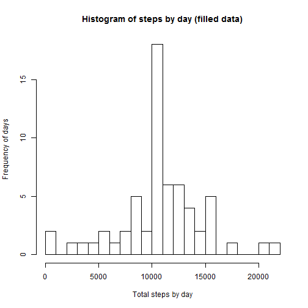

# Reproducible Research: Peer Assessment 1


## Loading and preprocessing the data

```r
fname <- 'activity.csv';
d <- read.csv(fname, header=TRUE, sep=',', strip.white=TRUE);
```

## What is mean total number of steps taken per day?


```r
# split the data by date to get total steps for each day
data_by_date <- split(d,d$date);
total_steps_by_day <- lapply(data_by_date,
                             function(x) {sum(x$steps, na.rm=TRUE)});
total_steps_by_day <- unlist(total_steps_by_day);
hist(total_steps_by_day, breaks=25,
     xlab = "Total steps by day",
     ylab = "Frequency of days",
     main = "Histogram of steps by day");
```

 


```r
  mean_steps <- mean(total_steps_by_day, na.rm=TRUE);
  median_steps <- median(total_steps_by_day, na.rm=TRUE);
```
The mean total number of steps taken per day is *9354.2295* and the median is *10395*.


## What is the average daily activity pattern?


```r
data_by_interval <- split(d, d$interval);
mean_steps_by_interval <- lapply(data_by_interval, function(x) {mean(x$steps,na.rm=TRUE)} );

ul <- unlist(mean_steps_by_interval);
plot(names(ul), ul, type='l',
     main='Plot of steps per 5 minute intervals averaged across all days',
     xlab='5 minute interval', 
     ylab='Average steps per interval for all days',
     );

# calculate the maximum in the averaged 5 minute intervals
max_name <- names(which.max(ul));
max_val <- ul[max_name];
# plot the max peak
abline(v=max_name, lty=2, col='red');
legend('topright', legend=c('max peak'), lty=c(2), col=c('red'));
```

 

The maximum mean value of steps per interval is *206.1698* for interval *835*. The maximum is highlighted in a plot as a dashed red line.


## Inputing missing values

There is total 2304 missing values for number of steps per 5 minute interval across all dataset.

Mising values for steps are replaced with an average value of steps per interval averaged across all days.


```r
# fill the NA steps with avg values
dfilled <- transform(d, steps=ifelse(is.na(steps),ul[as.character(interval)],steps));
```

The filled data will be plotted again and the plots compared to plots of raw data.


```r
data_by_date2 <- split(dfilled,dfilled$date);
total_steps_by_day2 <- lapply(data_by_date2,
                             function(x) {sum(x$steps, na.rm=TRUE)});
total_steps_by_day2 <- unlist(total_steps_by_day2);
hist(total_steps_by_day2, breaks=25,
     xlab = "Total steps by day",
     ylab = "Frequency of days",
     main = "Histogram of steps by day");
```

 


```r
  options(scipen=5);
  mean_steps2 <- mean(total_steps_by_day2);
  median_steps2 <- median(total_steps_by_day2);
```

For our filled data the mean total number of steps taken per day is *10766.1887* and the median is *10766.1887*. The mean value did rise up by 1411.9592 steps with replacing missing values in data set with averaged steps. Step values for some days did rise up. The new median value is by coincidence filled by an averaged number, therefore is equal to mean.

## Are there differences in activity patterns between weekdays and weekends?


```r
# create weekday / weekend factor
dfilled <- transform(dfilled, date =as.POSIXlt(date));
dfilled <- transform(dfilled, weekday=ifelse(
      ((date$wday==0) | (date$wday==6)),
      "weekend",
      "weekday"));

# Average steps by interval across all weekday days
data_weekday <- dfilled[dfilled$weekday=='weekday',];
data_by_interval <- split(data_weekday, data_weekday$interval);
mean_steps_weekday <- lapply(data_by_interval, function(x) {mean(x$steps,na.rm=TRUE)} );
mean_steps_weekday <- unlist(mean_steps_weekday);
mean_steps_weekday <- data.frame(interval = names(mean_steps_weekday),
           steps = mean_steps_weekday, weekday='weekday');

# Average steps by interval across all weekend days
data_weekend <- dfilled[dfilled$weekday=='weekend',];
data_by_interval <- split(data_weekend, data_weekend$interval);
mean_steps_weekend <- lapply(data_by_interval, function(x) {mean(x$steps,na.rm=TRUE)} );
mean_steps_weekend <- unlist(mean_steps_weekend);
mean_steps_weekend <- data.frame(interval = names(mean_steps_weekend),
           steps = mean_steps_weekend, weekday='weekend');

# join data back for plotting using lattice
weekdata <- rbind(mean_steps_weekday, mean_steps_weekend);
weekdata <- transform(weekdata, interval = as.numeric(as.character(interval)));

library(lattice)
xyplot(steps ~ interval | weekday,
       data = weekdata[order(weekdata$interval),],
       layout = c(1,2), type='l',
       xlab = 'Interval',
       ylab = 'Number of steps');
```

 

This plot reveals that there is on average more walking activity during weekends than during weekdays.
